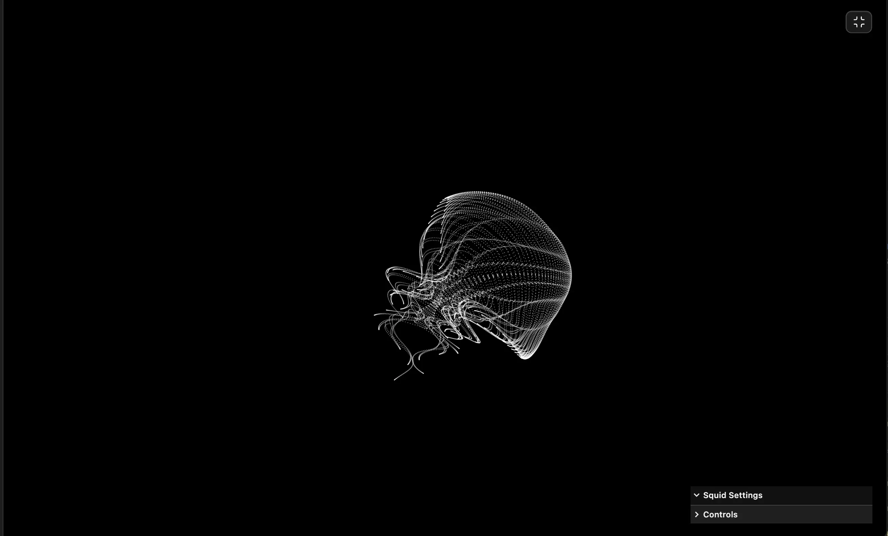

### Tab: ProceduralSquid

- **Description**: An interactive procedural life-form simulation powered by p5.js that utilizes organic math-based tentacle dynamics and fluid steering physics. It creates a deeply immersive, responsive generative experience through tactical parameter control.

- **Does**:
   
    - **Organic Procedural Dynamics**:    
        - **Negative Equation Uncurling**: Utilizes polarized math reflections to organically swing tentacle clusters to the opposite body-side during directional shifts.
        - **High-Performance Point Cloud**: Implements an optimized 2D matrix rotation pipeline capable of rendering 100,000+ points structurally without canvas-state overhead.
    - **Fluid Steering Physics**:
        - **Inertia-Based Navigation**: Features a steering-force model that calculates desire-vectors vs. inertia for natural, weighted life-form movement.
        - **Heading Synthesis**: Performs real-time 360-degree orientation smoothing, ensuring the squid's 'head' always leads the velocity vector gracefully.
    - **Interactive Topology Engine**:
        - **Dual-Squid Yin-Yang Mode**: Supports a procedural mirrored-state mode that creates complex, overlapping topological patterns between two entities.
        - **Tactical Parameter Control**: Integrates lil-gui for real-time manipulation of turn agility, point density, structural scale, and tonal palettes.

- **Can’t**:
   
    - **Persistent State Storage**: User-defined parameter presets and color configurations are session-based and do not persist across workspace reloads.    
    - **Multi-Layer Blend Compositing**: The rendering engine is optimized for single-buffer point-cloud drawing; complex multi-layer blending modes are not supported.
    - **Vector Asset Export**: The animation logic is strictly point-based; the component does not provide SVG or vector-path export capabilities.

----

### Components

###### [ProceduralSquid Viewer](D.q.proceduralsquid.viewer.md)
