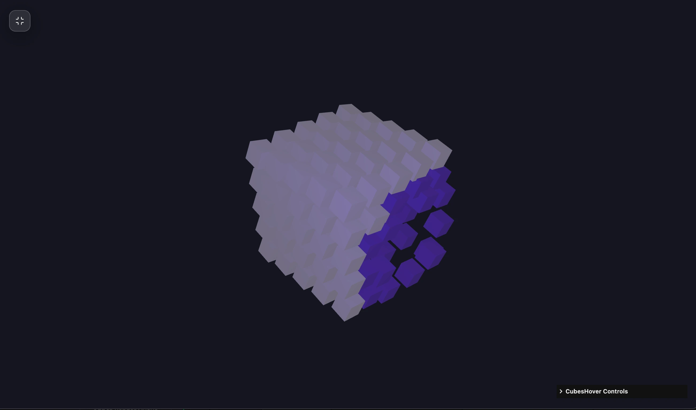

### Tab: CubesHover

- **Description**: An interactive 3D repulsion grid system powered by Three.js that utilizes raycasted physics to create dynamic, responsive cubic topologies. It combines sophisticated spatial math with a customizable HUD for a deeply interactive technical experience.

- **Does**:
   
    - **Procedural Grid Synthesis**:    
        - **Dynamic Stride Mapping**: Generates a symmetrical 3D cubic lattice based on variable stride counts (2x2x2 to 8x8x8) and gap intervals.
        - **Cubic Lerp Smoothing**: Utilizes frame-by-frame linear interpolation to ensure fluid transitions for both mesh positions and emissive color states.
    - **Interactive Repulsion Physics**:
        - **Raycasted Displacement Field**: Projects a 3D repulsion vector from the cursor intersection point, triggering localized structural deformation in the grid.
        - **Inertia-Based Restoration**: Implements weighted physics logic that causes displaced nodes to organically return to their origin coordinates when the repulsion field retreats.
    - **Enhanced Visual HUD**:
        - **Integrated Control Sidebar**: Provides real-time manipulation of physical constants including Repulsion Radius, Repulsion Strength, and Grid Stride via lil-gui.
        - **Volumetric Lighting Pipeline**: Features a synchronized ambient and point-lighting system for high-contrast spatial depth and shadow dynamics.

- **Can’t**:
   
    - **Non-Cubic Geometry Support**: The procedural generation engine is strictly optimized for cubic meshes; custom OBJ or GLTF geometry injection into the grid is not supported.    
    - **Persistence of HUD Presets**: Adjusted physics parameters and color configurations are session-based and reset to defaults upon workspace initialization.
    - **Inter-Entity Collision Math**: Physics calculations focus on cursor-to-node repulsion; individual cubes do not possess collision volumes relative to one another.

----

### Components

###### [CubesHover Viewer](D.q.cubeshover.viewer.md)
