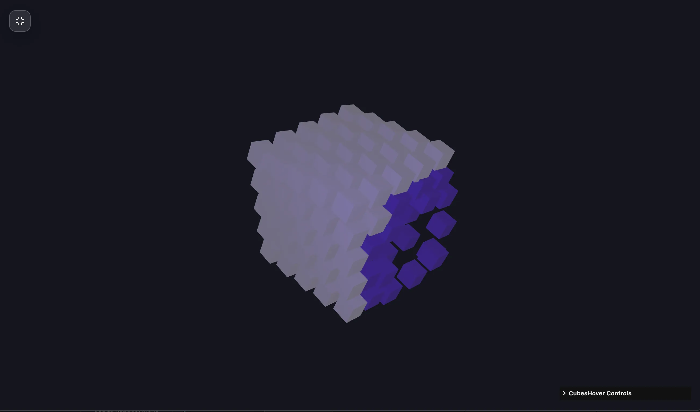

### Tab: Cubes Hover

- **Description**: Cubes Hover is an interactive 3D repulsion grid system powered by Three.js that utilizes raycasted physics to create dynamic, responsive cubic topologies. It combines sophisticated spatial math with a customizable HUD for a deeply interactive technical experience, where nodes organically respond to cursor proximity.

- **Does**:

    - **Procedural Grid Synthesis**: Generates symmetrical 3D cubic lattices based on variable stride counts and gap intervals.
    - **Cubic Lerp Smoothing**: Frame-by-frame linear interpolation for fluid transitions of mesh position and emissive state.
    - **Raycasted Displacement Field**: Projects 3D repulsion vectors from the cursor intersection to trigger structural deformation.
    - **Inertia-Based Restoration**: Weighted physics logic forces displaced nodes to return organically to origin coordinates.
    - **Interactive Control Sidebar**: Real-time manipulation of Repulsion Radius, Strength, and Grid Stride via lil-gui.
    - **Volumetric Lighting Pipeline**: Synchronized ambient and point-lighting for high-contrast spatial depth.

- **Can't**:

    - **External Geometry Injection**: The engine is strictly optimized for cubic meshes; does not support custom `.OBJ` imports.
    - **Persistence of HUD States**: Adjusted physics parameters and color configurations are session-based.
    - **Inter-Node Collision Math**: Calculations focus on cursor-to-node repulsion; individual cubes do not collide with each other.

------

### Components
###### [Cubes Hover Viewer](D.q.cubeshover.viewer.md)
###### [Cubes Hover Components {index.jsx}](_RESOURCES/DATACORE/96%20CubesHover/src/index.jsx)
