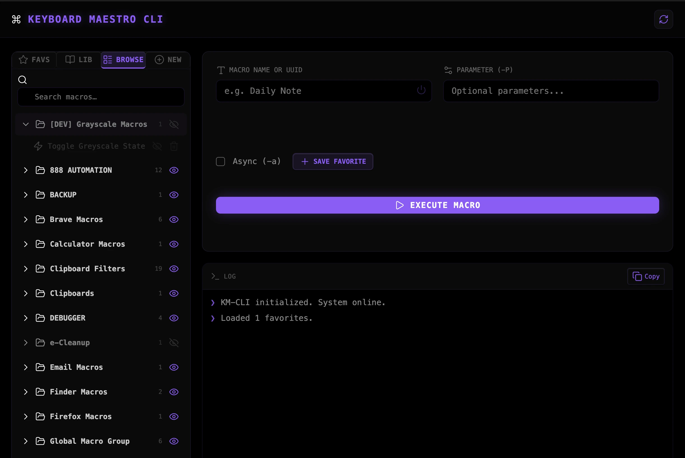

### Tab: Keyboard Maestro CLI

- **Description**: Keyboard Maestro CLI is a tactical automation engine for macOS that provides a high-fidelity bridge for macro execution, library management, and dynamic synthesis. It enables seamless integration between Datacore workflows and OS-level automations using a robust AppleScript execution kernel.

- **Does**:

    - **Multi-Vector Execution Engine**: Macro triggers via Name or UUID using osascript-bridged parameter handling.
    - **Asynchronous Execution Logic**: Spawns independent processes for long-running macros without blocking UI states.
    - **Procedural Macro Synthesis**: Dynamically builds and injects `.kmmacros` XML files into the KM engine.
    - **Contextual Library Browser**: Real-time traversal and state-toggling of the entire Keyboard Maestro group hierarchy.
    - **Persistent Favorites Registry**: Localized storage for high-frequency automations with integrated "Power" toggles.
    - **Live Terminal Telemetry Log**: High-contrast log area for trigger statuses and AppleScript debugging codes.

- **Can't**:

    - **Cross-Platform Compatibility**: Strictly dependent on macOS-exclusive AppleScript and Keyboard Maestro binaries.
    - **System Permission Overrides**: Subject to macOS Accessibility/Automation permissions; cannot bypass TCC prompts.
    - **Independent Engine Execution**: Requires an active, licensed installation of Keyboard Maestro on the host system.
    

------

### Components
###### [Keyboard Maestro CLI Viewer](D.q.kmcli.viewer.md)
###### [Keyboard Maestro CLI Components {index.jsx}](src/index.jsx)
