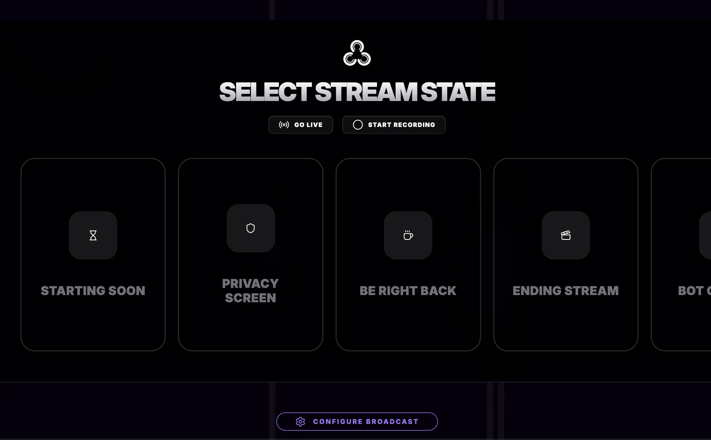

### Tab: Live Stream Manager

- **Description**: A tactical live-stream orchestration HUD designed for multi-platform broadcasting and real-time social engagement. It enables streamers to manage their broadcast pipeline, monitor real-time engagement metrics, and trigger OBS-level scene transitions—all within a unified, high-fidelity Obsidian interface.

- **Does**:
    - **Stream Orchestration HUD**: WebSocket connection to OBS Studio for real-time scene switching, source toggling, and recording control.
    - **Live Telemetry Monitoring**: Broadcast health dashboard for monitoring dropped frames and bitrate stability.
    - **Engagement Engine**: Multi-platform chat integration with sentiment filtering and sterile HUD readability.
    - **Real-Time Alert Pipeline**: Visual notifications for followers, subscribers, and donations directly within Datacore.
    - **Broadcast Asset Library**: Localized registry for broadcast layouts and overlay configurations.
    - **Tactical Hotkeys**: Global keyboard listener for triggering stream-events without leaving the workspace.

- **Can't**:

    - **Native Transcoding**: Acts as a controller; does not perform native H.264/H.265 video encoding.
    - **External API Dependency**: Relies on host-level API access and OBS WebSocket permissions; subject to platform rate limits.
    - **Standalone Broadcasting**: Requires primary broadcasting software (e.g., OBS Studio) to be active.

------

### Components
###### [Live Stream Manager Viewer](D.q.livestreammanager.viewer.md)
###### [Live Stream Manager Components {index.jsx}](src/index.jsx)
