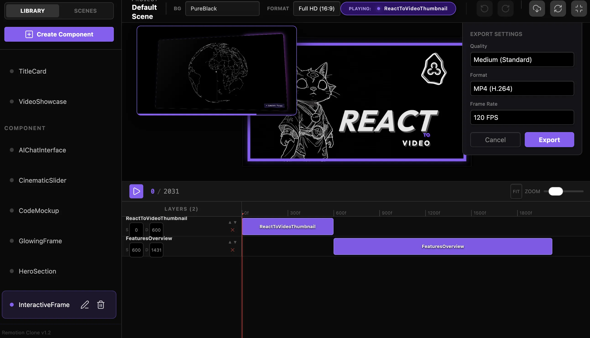

### Tab: Remotion Clone v1

- **Description**: Remotion Clone v1 is the foundational orchestration engine for React-based cinematic motion graphics. It provides the core timeline logic and frame-accurate playback foundation for the entire BetoOS motion suite, enabling developers to build complex, sequenceable animations within a native Obsidian environment.

- **Does**:

    - **Frame-based Timeline**: High-precision frame scrubbing with real-time feedback for complex animations.
    - **Sequencer Foundation**: Core logic for clip temporal alignment and stage management.
    - **Stage Orchestration**: Brute-force DOM reparenting to ensure immersive Full-Tab playback.
    - **Performance Optimized**: Locked 30fps playback engine designed for real-time code-to-video evaluation.

- **Can't**:

    - **Advanced Export Pipeline**: Lacks the high-speed native frame-synthesis available in v2.
    - **Modular Library Discovery**: Components must be manually registered in the foundational composition tree.

------

### Components
###### [Remotion Clone Viewer v1](D.q.remotionclone.viewer.v1.md)
###### [Remotion Clone Components v1 {index.jsx}](src/index.jsx)

