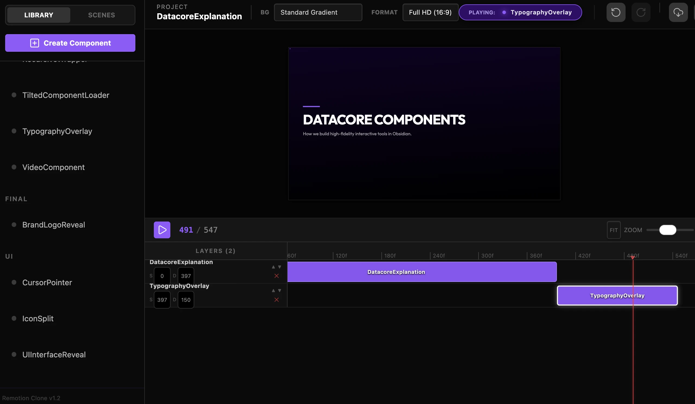

### Tab: Remotion Video Engine v2

- **Description**: Remotion v2 is a professional-grade cinematic motion engine designed for building data-driven motion graphics using React. It features an extensive modular library of high-fidelity visual components, a frame-accurate rendering pipeline, and native Obsidian bridge integration for industrial-scale video production.

- **Does**:

    - **Cinematic Motion Engine**:
        - **Modular Library**: Includes 50+ high-fidelity visual components like AuroraLines, KineticTypography, and ParticleFields.
        - **Frame-Accurate Rendering**: Optimized synthesis pipeline via libvpx-vp9 for industrial-scale video production.
    - **Obsidian Bridge Integration**:
        - Features full bi-directional communication between the React cinematic stage and the Obsidian environment.
        - Automatic asset discovery and sequencing of custom React scenes.
    - **Production Timeline**:
        - High-precision keyframe sequencing with real-time preview and multi-channel orchestration.

- **Can't**:

    - **Real-Time Audio**: Audio tracks require final synthesis in the rendering pipeline for frame-perfect synchronization.
    - **Bridge Dependency**: Must reside within the Datacore environment for bi-directional protocol synchronization.

------

### Components
###### [Remotion Viewer v2](D.q.remotion.viewer.v2.md)
###### [Remotion Video Engine Components {index.jsx}](_RESOURCES/DATACORE/99.2%20Remotion/src/index.jsx)