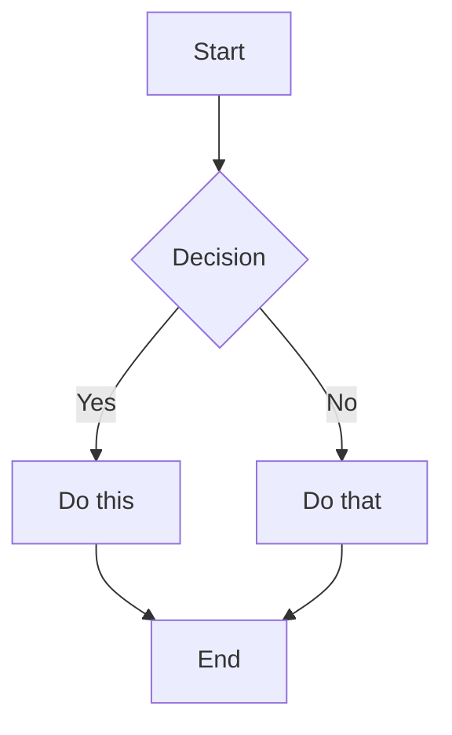
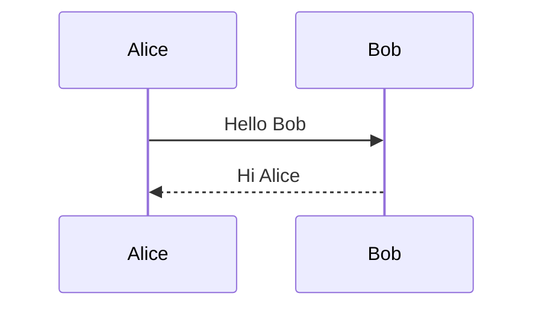

<!--
Source: Based on Obsidian Sample Theme
Last synced: See sync-status.json for authoritative sync dates
Update frequency: Check Obsidian Sample Theme repo for updates
-->

# Environment & tooling

- **Optional**: Node.js and npm if using SCSS/Sass preprocessors or build tools.
- **Simple themes**: Can be developed with just CSS and `manifest.json` (no build tools required).
- **SCSS themes**: Use Sass/SCSS compiler (e.g., `sass`, `node-sass`, or build tools like Vite).
- No TypeScript or bundler required for basic themes.

## Simple Theme Setup

No build tools needed - just edit `theme.css` directly.

## SCSS Theme Setup

```bash
npm install -D sass
npm run build  # Compile SCSS to CSS
```

## Theme Build Tools (Optional)

Simple themes with just CSS don't need build tools. More complex themes might use Grunt, npm scripts, or other build tools for tasks like SCSS compilation, minification, or preprocessing:

```bash
# For themes using Grunt
npx grunt build

# For themes using npm scripts
npm run build
```

Only use build commands if your theme has a `Gruntfile.js`, `package.json` with build scripts, or other build configuration files.

## Linting (Optional)

- Use `stylelint` for CSS/SCSS linting: `npm install -D stylelint`
- Configure stylelint for Obsidian theme conventions
- **Quick Setup**: Run `node scripts/setup-stylelint.mjs` to set up Stylelint with helpful success messages
- **Run Stylelint**:
  ```bash
  npm run lint        # Uses lint-wrapper.mjs for helpful success messages
  npm run lint:fix    # Auto-fix issues where possible
  ```

**Note**: The setup script automatically creates `scripts/lint-wrapper.mjs` which adds helpful success messages when linting passes. The wrapper is included in the template and copied during setup.


<!--
Source: Based on Obsidian Sample Theme
Last synced: See sync-status.json for authoritative sync dates
Update frequency: Check Obsidian Sample Theme repo for updates
-->

# File & folder conventions

- **Organize CSS/SCSS into logical files**: Split styles into separate files for maintainability.
- **Theme structure patterns**:
  - **Simple CSS theme** (recommended for simple themes): `theme.css` in project root, no build step required
  - **Complex theme with build tools** (for themes using SCSS, Grunt, etc.): `src/scss/` directory with SCSS source files that compile to `theme.css`
  - **CRITICAL**: Never have both `theme.css` as source AND `src/scss/` - choose one pattern

## Simple CSS Theme Structure

**Recommended for simple themes** (like the sample theme template):
```
theme.css          # ✅ Source CSS file (edit directly)
manifest.json
package.json
```

- No build step required - just edit `theme.css` directly
- Changes take effect when Obsidian reloads the theme
- Perfect for learning and simple themes

## Complex Theme Structure (SCSS + Build Tools)

**For themes using SCSS, Grunt, npm scripts, or other build tools**:
```
src/
  scss/            # ✅ SCSS source files
    index.scss
    variables.scss
    components/
  css/            # Compiled CSS (intermediate, not committed)
    main.css
theme.css         # ✅ Final compiled output (committed)
Gruntfile.js      # Build configuration (if using Grunt)
manifest.json
package.json
```

- Source files in `src/scss/` are compiled to `theme.css`
- Build tools (Grunt, npm scripts, etc.) handle compilation
- Run build command after making changes (see [build-workflow.md](build-workflow.md))
- **Example**: The `obsidian-oxygen` theme uses this pattern with Grunt

## Wrong Structure (Common Mistakes)

```
theme.css         # ❌ DON'T have both
src/
  scss/          # ❌ This causes confusion about which is the source
    index.scss
```

**Best practice**: Choose one pattern and stick with it. Simple themes should use `theme.css` directly. Complex themes should use `src/scss/` and compile to `theme.css`.

- **Do not commit build artifacts**: Never commit `node_modules/`, intermediate compiled CSS files (like `src/css/main.css`), or other generated files. Only commit `theme.css` (the final output).
- Keep themes lightweight. Avoid complex build processes unless necessary.
- Release artifacts: `manifest.json` and `theme.css` must be at the top level of the theme folder in the vault.


<!--
Source: Based on Obsidian community guidelines
Last synced: See sync-status.json for authoritative sync dates
Update frequency: Check Obsidian releases repo for validation requirements
-->

# Manifest rules (`manifest.json`)

### Required Fields

All themes must include these fields in `manifest.json`:

- **`name`** (string, required) - Theme name
- **`version`** (string, required) - Semantic Versioning format `x.y.z` (e.g., `"1.0.0"`)
- **`minAppVersion`** (string, required) - Minimum Obsidian version required
- **`author`** (string, required) - Author name (required for themes)

### Optional Fields

- **`authorUrl`** (string, optional) - URL to author's website or profile
- **`fundingUrl`** (string, optional) - URL for funding/support

### Important Notes

- Themes do **not** use `id` or `isDesktopOnly` fields.
- Canonical requirements: https://github.com/obsidianmd/obsidian-releases/blob/master/.github/workflows/validate-theme-entry.yml

## Validation Checklist

When reviewing or creating a `manifest.json` file, ensure:

- [ ] All required fields are present (`name`, `version`, `minAppVersion`, `author`)
- [ ] `version` follows semantic versioning (x.y.z)
- [ ] `minAppVersion` is set appropriately
- [ ] JSON syntax is valid (proper quotes, commas, brackets)
- [ ] All string values are properly quoted
- [ ] No plugin-specific fields (`id`, `isDesktopOnly`) are present


<!--
Source: Based on Obsidian community best practices
Last synced: See sync-status.json for authoritative sync dates
Update frequency: Check Obsidian community discussions for updates
-->

# Mobile

- Test themes on iOS and Android devices.
- Ensure CSS works correctly on mobile viewports.
- Consider touch-friendly UI elements and spacing.
- Test theme appearance in both light and dark modes on mobile.


<!--
Source: Based on obsidian-skills (https://github.com/kepano/obsidian-skills) and Obsidian documentation
Last synced: See sync-status.json for authoritative sync dates
Update frequency: Check obsidian-skills and Obsidian documentation for updates
Applicability: Both (Plugin/Theme)
-->

# Obsidian File Formats and Syntax

This guide provides comprehensive information about Obsidian file formats and syntax for AI agents working on Obsidian plugins and themes. This is essential knowledge for plugins that manipulate vault files, parse Markdown, or work with Obsidian-specific formats.

## Overview

Obsidian supports several file formats:
- **Markdown** (`.md`) - Obsidian Flavored Markdown with extensions
- **Bases** (`.base`) - YAML-based database views
- **Canvas** (`.canvas`) - JSON Canvas format for visual canvases

## Obsidian Flavored Markdown

Obsidian uses a combination of Markdown flavors:
- [CommonMark](https://commonmark.org/)
- [GitHub Flavored Markdown](https://github.github.com/gfm/)
- [LaTeX](https://www.latex-project.org/) for math
- Obsidian-specific extensions (wikilinks, callouts, embeds, properties, etc.)

### Basic Formatting

#### Paragraphs and Line Breaks

```markdown
This is a paragraph.

This is another paragraph (blank line between creates separate paragraphs).

For a line break within a paragraph, add two spaces at the end  
or use Shift+Enter.
```

#### Headings

```markdown
# Heading 1
## Heading 2
### Heading 3
#### Heading 4
##### Heading 5
###### Heading 6
```

#### Text Formatting

| Style | Syntax | Example | Output |
|-------|--------|---------|--------|
| Bold | `**text**` or `__text__` | `**Bold**` | **Bold** |
| Italic | `*text*` or `_text_` | `*Italic*` | *Italic* |
| Bold + Italic | `***text***` | `***Both***` | ***Both*** |
| Strikethrough | `~~text~~` | `~~Striked~~` | ~~Striked~~ |
| Highlight | `==text==` | `==Highlighted==` | ==Highlighted== |
| Inline code | `` `code` `` | `` `code` `` | `code` |

#### Escaping Formatting

Use backslash to escape special characters:
```markdown
\*This won't be italic\*
\#This won't be a heading
1\. This won't be a list item
```

Common characters to escape: `\*`, `\_`, `\#`, `` \` ``, `\|`, `\~`

### Internal Links (Wikilinks)

Wikilinks are Obsidian's primary linking mechanism.

#### Basic Links

```markdown
[[Note Name]]
[[Note Name.md]]
[[Note Name|Display Text]]
```

#### Link to Headings

```markdown
[[Note Name#Heading]]
[[Note Name#Heading|Custom Text]]
[[#Heading in same note]]
[[##Search all headings in vault]]
```

#### Link to Blocks

```markdown
[[Note Name#^block-id]]
[[Note Name#^block-id|Custom Text]]
```

Define a block ID by adding `^block-id` at the end of a paragraph:
```markdown
This is a paragraph that can be linked to. ^my-block-id
```

For lists and quotes, add the block ID on a separate line:
```markdown
> This is a quote
> With multiple lines

^quote-id
```

#### Search Links

```markdown
[[##heading]]     Search for headings containing "heading"
[[^^block]]       Search for blocks containing "block"
```

### Markdown-Style Links

```markdown
[Display Text](Note%20Name.md)
[Display Text](Note%20Name.md#Heading)
[Display Text](https://example.com)
[Note](obsidian://open?vault=VaultName&file=Note.md)
```

**Note**: Spaces must be URL-encoded as `%20` in Markdown links.

### Embeds

#### Embed Notes

```markdown
![[Note Name]]
![[Note Name#Heading]]
![[Note Name#^block-id]]
```

#### Embed Images

```markdown
![[image.png]]
![[image.png|640x480]]    Width x Height
![[image.png|300]]        Width only (maintains aspect ratio)
```

#### External Images

```markdown


```

#### Embed Audio

```markdown
![[audio.mp3]]
![[audio.ogg]]
```

#### Embed PDF

```markdown
![[document.pdf]]
![[document.pdf#page=3]]
![[document.pdf#height=400]]
```

#### Embed Lists

```markdown
![[Note#^list-id]]
```

Where the list has been defined with a block ID:
```markdown
- Item 1
- Item 2
- Item 3

^list-id
```

#### Embed Search Results

````markdown
```query
tag:#project status:done
```
````

### Callouts

#### Basic Callout

```markdown
> [!note]
> This is a note callout.

> [!info] Custom Title
> This callout has a custom title.

> [!tip] Title Only
```

#### Foldable Callouts

```markdown
> [!faq]- Collapsed by default
> This content is hidden until expanded.

> [!faq]+ Expanded by default
> This content is visible but can be collapsed.
```

#### Nested Callouts

```markdown
> [!question] Outer callout
> > [!note] Inner callout
> > Nested content
```

#### Supported Callout Types

| Type | Aliases | Description |
|------|---------|-------------|
| `note` | - | Blue, pencil icon |
| `abstract` | `summary`, `tldr` | Teal, clipboard icon |
| `info` | - | Blue, info icon |
| `todo` | - | Blue, checkbox icon |
| `tip` | `hint`, `important` | Cyan, flame icon |
| `success` | `check`, `done` | Green, checkmark icon |
| `question` | `help`, `faq` | Yellow, question mark |
| `warning` | `caution`, `attention` | Orange, warning icon |
| `failure` | `fail`, `missing` | Red, X icon |
| `danger` | `error` | Red, zap icon |
| `bug` | - | Red, bug icon |
| `example` | - | Purple, list icon |
| `quote` | `cite` | Gray, quote icon |

### Lists

#### Unordered Lists

```markdown
- Item 1
- Item 2
  - Nested item
  - Another nested
- Item 3

* Also works with asterisks
+ Or plus signs
```

#### Ordered Lists

```markdown
1. First item
2. Second item
   1. Nested numbered
   2. Another nested
3. Third item

1) Alternative syntax
2) With parentheses
```

#### Task Lists

```markdown
- [ ] Incomplete task
- [x] Completed task
- [ ] Task with sub-tasks
  - [ ] Subtask 1
  - [x] Subtask 2
```

### Quotes

```markdown
> This is a blockquote.
> It can span multiple lines.
>
> And include multiple paragraphs.
>
> > Nested quotes work too.
```

### Code

#### Inline Code

```markdown
Use `backticks` for inline code.
Use double backticks for ``code with a ` backtick inside``.
```

#### Code Blocks

````markdown
```
Plain code block
```

```javascript
// Syntax highlighted code block
function hello() {
  console.log("Hello, world!");
}
```

```python
# Python example
def greet(name):
    print(f"Hello, {name}!")
```
````

#### Nesting Code Blocks

Use more backticks or tildes for the outer block:

`````markdown
````markdown
Here's how to create a code block:
```js
console.log("Hello")
```
````
`````

### Tables

```markdown
| Header 1 | Header 2 | Header 3 |
|----------|----------|----------|
| Cell 1   | Cell 2   | Cell 3   |
| Cell 4   | Cell 5   | Cell 6   |
```

#### Alignment

```markdown
| Left     | Center   | Right    |
|:---------|:--------:|---------:|
| Left     | Center   | Right    |
```

#### Using Pipes in Tables

Escape pipes with backslash:
```markdown
| Column 1 | Column 2 |
|----------|----------|
| [[Link\|Display]] | ![[Image\|100]] |
```

### Math (LaTeX)

#### Inline Math

```markdown
This is inline math: $e^{i\pi} + 1 = 0$
```

#### Block Math

```markdown
$$
\begin{vmatrix}
a & b \\
c & d
\end{vmatrix} = ad - bc
$$
```

#### Common Math Syntax

```markdown
$x^2$              Superscript
$x_i$              Subscript
$\frac{a}{b}$      Fraction
$\sqrt{x}$         Square root
$\sum_{i=1}^{n}$   Summation
$\int_a^b$         Integral
$\alpha, \beta$    Greek letters
```

### Diagrams (Mermaid)

````markdown

````

#### Sequence Diagrams

````markdown

````

### Footnotes

```markdown
This sentence has a footnote[^1].

[^1]: This is the footnote content.

You can also use named footnotes[^note].

[^note]: Named footnotes still appear as numbers.

Inline footnotes are also supported.^[This is an inline footnote.]
```

### Comments

```markdown
This is visible %%but this is hidden%% text.

%%
This entire block is hidden.
It won't appear in reading view.
%%
```

### Horizontal Rules

```markdown
---
***
___
- - -
* * *
```

### Properties (YAML metadata)

**Important**: Obsidian uses the term "properties" (not "frontmatter" or "front-matter") when referring to YAML metadata at the top of Markdown files. All documentation, code comments, and UI text should use "properties" to align with Obsidian's official terminology.

Properties use YAML metadata (properties) at the start of a note:

```yaml
---
title: My Note Title
date: 2024-01-15
tags:
  - project
  - important
aliases:
  - My Note
  - Alternative Name
cssclasses:
  - custom-class
status: in-progress
rating: 4.5
completed: false
due: 2024-02-01T14:30:00
---
```

#### Property Types

| Type | Example |
|------|---------|
| Text | `title: My Title` |
| Number | `rating: 4.5` |
| Checkbox | `completed: true` |
| Date | `date: 2024-01-15` |
| Date & Time | `due: 2024-01-15T14:30:00` |
| List | `tags: [one, two]` or YAML list |
| Links | `related: "[[Other Note]]"` |

#### Default Properties

- `tags` - Note tags
- `aliases` - Alternative names for the note
- `cssclasses` - CSS classes applied to the note

### Tags

```markdown
#tag
#nested/tag
#tag-with-dashes
#tag_with_underscores

In properties:
---
tags:
  - tag1
  - nested/tag2
---
```

Tags can contain:
- Letters (any language)
- Numbers (not as first character)
- Underscores `_`
- Hyphens `-`
- Forward slashes `/` (for nesting)

### HTML Content

Obsidian supports HTML within Markdown:

```markdown
<div class="custom-container">
  <span style="color: red;">Colored text</span>
</div>

<details>
  <summary>Click to expand</summary>
  Hidden content here.
</details>

<kbd>Ctrl</kbd> + <kbd>C</kbd>
```

## Obsidian Bases (.base files)

Obsidian Bases are YAML-based files that define dynamic views of notes in an Obsidian vault. A Base file can contain multiple views, global filters, formulas, property configurations, and custom summaries.

### File Format

Base files use the `.base` extension and contain valid YAML. They can also be embedded in Markdown code blocks.

### Complete Schema

```yaml
# Global filters apply to ALL views in the base
filters:
  # Can be a single filter string
  # OR a recursive filter object with and/or/not
  and: []
  or: []
  not: []

# Define formula properties that can be used across all views
formulas:
  formula_name: 'expression'

# Configure display names and settings for properties
properties:
  property_name:
    displayName: "Display Name"
  formula.formula_name:
    displayName: "Formula Display Name"
  file.ext:
    displayName: "Extension"

# Define custom summary formulas
summaries:
  custom_summary_name: 'values.mean().round(3)'

# Define one or more views
views:
  - type: table | cards | list | map
    name: "View Name"
    limit: 10                    # Optional: limit results
    groupBy:                     # Optional: group results
      property: property_name
      direction: ASC | DESC
    filters:                     # View-specific filters
      and: []
    order:                       # Properties to display in order
      - file.name
      - property_name
      - formula.formula_name
    summaries:                   # Map properties to summary formulas
      property_name: Average
```

### Filter Syntax

Filters narrow down results. They can be applied globally or per-view.

#### Filter Structure

```yaml
# Single filter
filters: 'status == "done"'

# AND - all conditions must be true
filters:
  and:
    - 'status == "done"'
    - 'priority > 3'

# OR - any condition can be true
filters:
  or:
    - 'file.hasTag("book")'
    - 'file.hasTag("article")'

# NOT - exclude matching items
filters:
  not:
    - 'file.hasTag("archived")'

# Nested filters
filters:
  or:
    - file.hasTag("tag")
    - and:
        - file.hasTag("book")
        - file.hasLink("Textbook")
    - not:
        - file.hasTag("book")
        - file.inFolder("Required Reading")
```

## JSON Canvas (.canvas files)

JSON Canvas is an open file format for infinite canvas data. Canvas files use the `.canvas` extension and contain valid JSON following the [JSON Canvas Spec 1.0](https://jsoncanvas.org/spec/1.0/).

### File Structure

A canvas file contains two top-level arrays:

```json
{
  "nodes": [],
  "edges": []
}
```

- `nodes` (optional): Array of node objects
- `edges` (optional): Array of edge objects connecting nodes

### Nodes

Nodes are objects placed on the canvas. There are four node types:
- `text` - Text content with Markdown
- `file` - Reference to files/attachments
- `link` - External URL
- `group` - Visual container for other nodes

#### Z-Index Ordering

Nodes are ordered by z-index in the array:
- First node = bottom layer (displayed below others)
- Last node = top layer (displayed above others)

#### Generic Node Attributes

All nodes share these attributes:

| Attribute | Required | Type | Description |
|-----------|----------|------|-------------|
| `id` | Yes | string | Unique identifier for the node |
| `type` | Yes | string | Node type: `text`, `file`, `link`, or `group` |
| `x` | Yes | integer | X position in pixels |
| `y` | Yes | integer | Y position in pixels |
| `width` | Yes | integer | Width in pixels |
| `height` | Yes | integer | Height in pixels |
| `color` | No | canvasColor | Node color (see Color section) |

#### Text Nodes

Text nodes contain Markdown content.

```json
{
  "id": "6f0ad84f44ce9c17",
  "type": "text",
  "x": 0,
  "y": 0,
  "width": 400,
  "height": 200,
  "text": "# Hello World\n\nThis is **Markdown** content."
}
```

#### File Nodes

File nodes reference files or attachments (images, videos, PDFs, notes, etc.).

```json
{
  "id": "a1b2c3d4e5f67890",
  "type": "file",
  "x": 500,
  "y": 0,
  "width": 400,
  "height": 300,
  "file": "Attachments/diagram.png"
}
```

#### Link Nodes

Link nodes reference external URLs.

```json
{
  "id": "b2c3d4e5f6789012",
  "type": "link",
  "x": 500,
  "y": 400,
  "width": 400,
  "height": 100,
  "url": "https://example.com"
}
```

#### Group Nodes

Group nodes are visual containers for other nodes.

```json
{
  "id": "c3d4e5f678901234",
  "type": "group",
  "x": 0,
  "y": 0,
  "width": 800,
  "height": 600,
  "label": "My Group"
}
```

### Edges

Edges connect nodes on the canvas.

```json
{
  "id": "edge-1",
  "fromNode": "node-1-id",
  "fromSide": "right",
  "toNode": "node-2-id",
  "toSide": "left",
  "color": "1",
  "label": "Connection"
}
```

## References

- [Obsidian Flavored Markdown](https://help.obsidian.md/obsidian-flavored-markdown)
- [Obsidian Bases Syntax](https://help.obsidian.md/bases/syntax)
- [JSON Canvas Specification](https://jsoncanvas.org/)
- [obsidian-skills repository](https://github.com/kepano/obsidian-skills) - Source of comprehensive syntax documentation
<!--
Source: Project-specific instructions
Last synced: See sync-status.json for authoritative sync dates
Update frequency: Update as reference management strategy evolves
-->

# .ref Folder Instructions

## Purpose

The `.ref` folder is a **gitignored directory** that uses **symlinks** to reference materials, documentation, and repositories. It acts as a "portal" to other locations on your computer, not a storage location itself.

**Key Concept**: The `.ref` folder should contain **symlinks** (not actual files) pointing to:
- **Global references** (like `obsidian-api`) → symlink to a central location (e.g., `C:\Users\david\Development\.ref\obsidian-dev`)
- **Local projects** you're developing → symlink to your working copy (e.g., `../my-other-plugin`)
- **External repos** → clone to central location first, then symlink

## Important: What Happens When Someone Clones This Repo?

**The `.ref` folder is gitignored**, so symlinks are **not committed** to the repository. When someone clones this repo:

1. The `.ref` folder will be **empty or missing**
2. They need to **set up their own symlinks** following the instructions below
3. They can either:
   - **Option A**: Set up a central `.ref/obsidian-dev` location and symlink to it (recommended for multiple projects)
   - **Option B**: Clone repos directly into `.ref` folder (simpler, but less efficient for multiple projects)

This is intentional - each developer manages their own reference setup based on their directory structure.

## Folder Organization

The `.ref` folder structure (via symlinks) should be organized as follows:

### Core Obsidian References (Always Relevant)

These 6 projects are **always relevant** for any Obsidian plugin or theme project. They should be symlinked in **every** project's `.ref` folder:

- **Root level**: Base Obsidian repositories (API, official docs, sample projects, linting)
  - `obsidian-api/` → symlink to central location
  - `obsidian-sample-plugin/` → symlink to central location
  - `obsidian-developer-docs/` → symlink to central location
  - `obsidian-plugin-docs/` → symlink to central location
  - `obsidian-sample-theme/` → symlink to central location
  - `eslint-plugin/` → symlink to central location (ESLint rules for Obsidian plugins)

### Project-Specific References (Optional, Project-Dependent)

These are **only relevant** to specific projects. They should be documented in `project-context.md` for each project that uses them:

- **`plugins/`**: Community plugins relevant to this specific project
  - Example: `.ref/plugins/some-community-plugin/` → symlink to central location or working copy
  - **Note**: Only add plugins that are specifically relevant to this project's development

- **`themes/`**: Community themes relevant to this specific project
  - Example: `.ref/themes/some-community-theme/` → symlink to central location or working copy
  - **Note**: Only add themes that are specifically relevant to this project's development

**Important**: The general `.agents` documentation focuses on the 6 core Obsidian projects. Project-specific plugins and themes should be documented in `project-context.md` for each project.

## For AI Agents

**IMPORTANT**: When the user asks you to reference something in `.ref`, actively search for it. The `.ref` folder may be hidden by default in some file explorers, but it exists in the project root. Use tools like `list_dir`, `glob_file_search`, or `read_file` to access `.ref` contents.

**Organization to remember**:
- **Core Obsidian repos** (always relevant) are in `.ref/` root (e.g., `.ref/obsidian-api/`)
- **Project-specific plugins** (only if relevant to this project) are in `.ref/plugins/` (e.g., `.ref/plugins/plugin-name/`)
- **Project-specific themes** (only if relevant to this project) are in `.ref/themes/` (e.g., `.ref/themes/theme-name/`)

**When adding references**:
- **External repos** (GitHub, GitLab, etc.) → Clone to `../.ref/obsidian-dev/` (global location), then create symlink in project's `.ref/`
- **Local projects** (projects you're developing) → Create symlink directly in project's `.ref/` pointing to the local project (don't clone to global)

If you cannot find `.ref` initially, try:
- Listing the root directory with hidden files enabled
- Using `glob_file_search` with pattern `.ref/**`
- Directly reading files with paths like `.ref/obsidian-api/README.md` or `.ref/plugins/plugin-name/main.ts`

### Checking for Updates to Reference Repos

**When the user asks about updates** (e.g., "are there any updates to the hider plugin repo?" or "check for updates to obsidian-api"):

1. **Search for the repo**:
   - For plugins: Search `.ref/plugins/` for matching names (use fuzzy matching - "hider" might match "hider-plugin", "obsidian-hider", etc.)
   - For themes: Search `.ref/themes/` for matching names
   - For base Obsidian repos: Check `.ref/` root (obsidian-api, obsidian-sample-plugin, etc.)

2. **Check for updates** (read-only operations are safe):
   ```bash
   # Navigate to the repo
   cd .ref/plugins/hider-plugin  # or whatever the actual folder name is
   
   # Fetch latest changes (read-only, safe)
   git fetch
   
   # Check what's new (compare local vs remote)
   git log HEAD..origin/main --oneline  # or origin/master, depending on default branch
   
   # Or see recent commits
   git log --oneline -10
   ```

3. **Report findings**:
   - If updates are available, show what changed (use `git log` or `git diff`)
   - Ask if the user wants to pull the updates
   - **Never automatically pull** - always ask first (see [agent-dos-donts.md](agent-dos-donts.md))

4. **If repo not found**:
   - List what's available in `.ref/plugins/` or `.ref/themes/`
   - Suggest adding it if it's not there yet (see "Adding Project-Specific References" section)

## First Time Setup

The goal is to have **one central `.ref/obsidian-dev` directory** on your computer that contains all Obsidian reference repos, and each project's `.ref` folder contains **symlinks** pointing to that central location. This avoids duplicating repos across projects and allows `.ref/` to be used for other purposes.

### Step 1: Set Up Central Reference Location (One-Time, Per Computer)

**Choose a central location** for all your Obsidian reference repos. This should be **outside** of any individual project folder. Common locations:
- Windows: `C:\Users\YourName\Development\.ref\obsidian-dev` or `C:\Development\.ref\obsidian-dev`
- macOS/Linux: `~/Development/.ref/obsidian-dev` or `/opt/ref/obsidian-dev`

**Clone the 6 core Obsidian projects once** to this central location:

```bash
# Navigate to your chosen central location
cd ~/Development  # or C:\Users\YourName\Development on Windows
mkdir -p .ref/obsidian-dev
cd .ref/obsidian-dev

# Clone all 6 core projects (one-time setup)
git clone https://github.com/obsidianmd/obsidian-api.git obsidian-api
git clone https://github.com/obsidianmd/obsidian-sample-plugin.git obsidian-sample-plugin
git clone https://github.com/obsidianmd/obsidian-developer-docs.git obsidian-developer-docs
git clone https://github.com/obsidianmd/obsidian-plugin-docs.git obsidian-plugin-docs
git clone https://github.com/obsidianmd/obsidian-sample-theme.git obsidian-sample-theme
git clone https://github.com/obsidianmd/eslint-plugin.git eslint-plugin
```

**Note**: You only do this once per computer. All your projects will symlink to this central location.

### Step 2: Create Symlinks in Each Project

**For each Obsidian project**, create symlinks pointing to your central location. The easiest way is to use the setup script:

**Windows**: Run `setup-ref-links.bat` from the project root
**macOS/Linux**: Run `./setup-ref-links.sh` from the project root

**Or manually** (if you prefer):

```bash
# From your project root, create .ref directory
mkdir .ref

# Windows (PowerShell - adjust path to your central .ref/obsidian-dev):
# If your central .ref/obsidian-dev is at C:\Users\YourName\Development\.ref\obsidian-dev
# and your project is at C:\Users\YourName\Development\my-plugin:
cmd /c mklink /J .ref\obsidian-api ..\.ref\obsidian-dev\obsidian-api
cmd /c mklink /J .ref\obsidian-sample-plugin ..\.ref\obsidian-dev\obsidian-sample-plugin
cmd /c mklink /J .ref\obsidian-developer-docs ..\.ref\obsidian-dev\obsidian-developer-docs
cmd /c mklink /J .ref\obsidian-plugin-docs ..\.ref\obsidian-dev\obsidian-plugin-docs
cmd /c mklink /J .ref\obsidian-sample-theme ..\.ref\obsidian-dev\obsidian-sample-theme
cmd /c mklink /J .ref\eslint-plugin ..\.ref\obsidian-dev\eslint-plugin

# macOS/Linux (adjust path to your central .ref/obsidian-dev):
# If your central .ref/obsidian-dev is at ~/Development/.ref/obsidian-dev
# and your project is at ~/Development/my-plugin:
ln -s ../.ref/obsidian-dev/obsidian-api .ref/obsidian-api
ln -s ../.ref/obsidian-dev/obsidian-sample-plugin .ref/obsidian-sample-plugin
ln -s ../.ref/obsidian-dev/obsidian-developer-docs .ref/obsidian-developer-docs
ln -s ../.ref/obsidian-dev/obsidian-plugin-docs .ref/obsidian-plugin-docs
ln -s ../.ref/obsidian-dev/obsidian-sample-theme .ref/obsidian-sample-theme
ln -s ../.ref/obsidian-dev/eslint-plugin .ref/eslint-plugin
```

**Important**: Adjust the relative path (`../.ref/obsidian-dev`) based on where your project is relative to your central `.ref/obsidian-dev` location. If they're in different directory structures, use absolute paths.

**Easiest method**: Use the setup scripts in the `scripts/` folder:
- **Windows**: `scripts\setup-ref-links.bat` or `.\scripts\setup-ref-links.ps1`
- **macOS/Linux**: `./scripts/setup-ref-links.sh`

These scripts will automatically:
- Detect your central `.ref/obsidian-dev` location
- Clone the 6 core Obsidian projects if they don't exist
- Pull the latest changes if the repos already exist
- Create all the symlinks for you

You can run the setup script anytime to keep your reference repos up to date.

## Updating References (Optional)

**Note**: Updates are **optional**. The reference materials work fine with whatever version was cloned initially. Most users never need to update. Only update if you want the latest documentation.

**Easiest way to update**: Simply re-run the setup script from any project:
- **Windows**: `scripts\setup-ref-links.bat` or `.\scripts\setup-ref-links.ps1`
- **macOS/Linux**: `./scripts/setup-ref-links.sh`

The setup script will automatically pull the latest changes for all 6 core repos if they already exist.

**Manual update** (if you prefer): Update all references at once from your central location:

```bash
# Navigate to the central location (adjust path as needed)
cd ../.ref/obsidian-dev  # or cd ~/Development/.ref/obsidian-dev

# Pull updates for all repos
cd obsidian-api && git pull && cd ..
cd obsidian-sample-plugin && git pull && cd ..
cd obsidian-developer-docs && git pull && cd ..
cd obsidian-plugin-docs && git pull && cd ..
cd obsidian-sample-theme && git pull && cd ..
cd eslint-plugin && git pull && cd ..
```

All plugin projects using symlinks will immediately see the updated content.

### Benefits

- **Single source of truth**: One clone that all projects reference
- **Easy updates**: One `git pull` updates all projects
- **Disk space efficient**: No duplicate clones
- **Works with Git**: Symlinks are transparent to Git operations
- **Flexibility**: Can also symlink to local projects you're developing

### Common Reference Repositories

**Core Obsidian Repositories (Always Relevant - Root Level)**:
These 6 projects should be symlinked in **every** Obsidian plugin/theme project:
- `obsidian-api`: Official Obsidian API documentation and type definitions
- `obsidian-sample-plugin`: Template plugin with best practices (contains `AGENTS.md` to sync from)
- `obsidian-developer-docs`: Source vault for docs.obsidian.md (official documentation)
- `obsidian-plugin-docs`: Plugin-specific documentation and guides
- `obsidian-sample-theme`: Theme template (useful for organizational patterns)
- `eslint-plugin`: ESLint rules for Obsidian plugins (catches common issues and enforces best practices)

**Project-Specific References (Optional - Organized in Subfolders)**:
These are only relevant to specific projects and should be documented in `project-context.md`:
- `plugins/`: Add community plugins here **only if they're relevant to this specific project**
- `themes/`: Add community themes here **only if they're relevant to this specific project**

**To add a community plugin or theme** (maintains single source of truth):

**Step 1**: Clone to central location:
```bash
# Navigate to central .ref location (adjust path as needed)
cd ../.ref/obsidian-dev/plugins  # or cd ~/Development/.ref/obsidian-dev/plugins
git clone https://github.com/username/plugin-name.git plugin-name

# For a theme
cd ../.ref/obsidian-dev/themes  # or cd ~/Development/.ref/obsidian-dev/themes
git clone https://github.com/username/theme-name.git theme-name
```

**Step 2**: Create symlink in your project:
```bash
# From your project root
# Create subdirectories if needed
mkdir -p .ref/plugins .ref/themes

# Windows:
cmd /c mklink /J .ref\plugins\plugin-name ..\.ref\obsidian-dev\plugins\plugin-name
cmd /c mklink /J .ref\themes\theme-name ..\.ref\obsidian-dev\themes\theme-name

# macOS/Linux:
ln -s ../../.ref/obsidian-dev/plugins/plugin-name .ref/plugins/plugin-name
ln -s ../../.ref/obsidian-dev/themes/theme-name .ref/themes/theme-name
```

**Note**: See [sync-procedure.md](sync-procedure.md) for the standard procedure to keep `.agents` content synchronized with updates from these repositories.

## Adding Additional References

When you want to add more references (plugins, themes, or other projects), choose the method based on your use case:

### Option A: External Repository (Add to Global .ref/obsidian-dev)

**Use when**: Referencing an external repository (GitHub, GitLab, etc.) that you want to check for updates periodically. 

**Important distinction**:
- **Core Obsidian projects** (the 6 always-relevant ones) → Always add to global `.ref/obsidian-dev` and symlink in **every** project
- **Project-specific plugins/themes** → Add to global `.ref/obsidian-dev` but **only symlink in projects that need them**. Document in `project-context.md`.

**Workflow**: 
1. **Check if already exists**: If the repo is already in `../.ref/obsidian-dev/`, skip to step 2
2. **Clone to global location**: Clone to `../.ref/obsidian-dev/` (or `../.ref/obsidian-dev/plugins/` or `../.ref/obsidian-dev/themes/` as appropriate)
3. **Create symlink in project**: Create symlink in this project's `.ref/` folder pointing to the global location
4. **Document if project-specific**: If it's project-specific, document it in `project-context.md`

This maintains a single source of truth - one clone in the global location that projects can reference as needed.

**Step 1: Clone to central location** (your global `.ref/obsidian-dev` folder)

**IMPORTANT**: Clone the repo **directly** into the target folder. The result should be `../.ref/obsidian-dev/plugins/plugin-name/` (the actual repo), NOT `../.ref/obsidian-dev/plugins/.ref/plugin-name/`. The repo folder name should match the project name.

```bash
# Navigate to your central .ref location (e.g., C:\Users\david\Development\.ref\obsidian-dev)
# For a community plugin
cd ../.ref/obsidian-dev/plugins  # or cd ~/Development/.ref/obsidian-dev/plugins
git clone https://github.com/username/plugin-name.git plugin-name
# Result: ../.ref/obsidian-dev/plugins/plugin-name/ (the actual repo folder)

# For a community theme
cd ../.ref/obsidian-dev/themes  # or cd ~/Development/.ref/obsidian-dev/themes
git clone https://github.com/username/theme-name.git theme-name
# Result: ../.ref/obsidian-dev/themes/theme-name/ (the actual repo folder)

# For other external projects (root level of obsidian-dev)
cd ../.ref/obsidian-dev  # or cd ~/Development/.ref/obsidian-dev
git clone https://github.com/username/repo-name.git repo-name
# Result: ../.ref/obsidian-dev/repo-name/ (the actual repo folder)
```

**Step 2: Create symlink in this project**
```bash
# From your project root
# Create subdirectories if needed
mkdir -p .ref/plugins .ref/themes

# Windows (adjust path to your central .ref/obsidian-dev location):
cmd /c mklink /J .ref\plugins\plugin-name ..\.ref\obsidian-dev\plugins\plugin-name
cmd /c mklink /J .ref\themes\theme-name ..\.ref\obsidian-dev\themes\theme-name
cmd /c mklink /J .ref\repo-name ..\.ref\obsidian-dev\repo-name

# macOS/Linux (adjust path to your central .ref/obsidian-dev location):
ln -s ../../.ref/obsidian-dev/plugins/plugin-name .ref/plugins/plugin-name
ln -s ../../.ref/obsidian-dev/themes/theme-name .ref/themes/theme-name
ln -s ../.ref/obsidian-dev/repo-name .ref/repo-name
```

**Benefits**: 
- Single source of truth - one clone in central location
- Can check for updates with `git pull` in central location
- All projects using symlinks see updates immediately
- Full Git history available
- Disk space efficient

**To check for updates later**:
```bash
# Update in central location (adjust path as needed)
cd ../.ref/obsidian-dev/plugins/plugin-name  # or cd ~/Development/.ref/obsidian-dev/plugins/plugin-name
git pull

# All projects with symlinks to this repo will immediately see the updates
```

### Option B: Local Project You're Developing (Symlink to Working Copy)

**Use when**: You're actively developing another project alongside this one and want to see changes in real-time. This should **NOT** be added to your global `.ref/obsidian-dev` - it should symlink directly to your working copy.

**Workflow**: 
1. **Create symlink directly**: Create a symlink directly from this project's `.ref/` folder to your working copy (e.g., `../my-other-plugin`)
2. **Do NOT clone**: Do not clone this to the global `.ref/` location - it's project-specific
3. **Document**: Document it in `project-context.md` if it's relevant to this project

This references your active development work, not a reference copy. Changes are immediately visible.

```bash
# From your project root
# Create subdirectories if needed
mkdir -p .ref/plugins .ref/themes

# Windows (adjust path to your working copy):
# Example: If you're in Development/my-plugin and want to reference Development/my-other-plugin:
cmd /c mklink /J .ref\plugins\my-other-plugin ..\my-other-plugin
cmd /c mklink /J .ref\themes\my-theme ..\my-theme
cmd /c mklink /J .ref\project-name ..\project-name

# macOS/Linux (adjust path to your working copy):
ln -s ../my-other-plugin .ref/plugins/my-other-plugin
ln -s ../my-theme .ref/themes/my-theme
ln -s ../project-name .ref/project-name
```

**Note**: 
- Adjust the relative path (`../`) based on your directory structure
- If your projects are in `Development/`, and you're in `Development/my-plugin`, use `../` to go up one level
- For absolute paths: `cmd /c mklink /J .ref\project-name C:\Users\david\Development\project-name` (Windows) or `ln -s ~/Development/project-name .ref/project-name` (Unix)

**Benefits**:
- References your active working copy (not a duplicate)
- Changes in your working copy are immediately visible
- Perfect for projects you're actively developing alongside this one
- No need to clone or copy - just symlink to where you're already working

**Note**: With symlinks, any changes you make to the original project are immediately visible in `.ref/project-name/` - no need to pull or sync. This is different from Option A, which clones to the central `.ref/obsidian-dev` location first.


### Quick Decision Guide

- **6 Core Obsidian projects** (obsidian-api, obsidian-sample-plugin, obsidian-developer-docs, obsidian-plugin-docs, obsidian-sample-theme, eslint-plugin) → **Always** clone to global `.ref/obsidian-dev` and symlink in **every** project
- **External repository** (GitHub, GitLab, etc.) that's project-specific → Use **Option A** - Clone to your **global/central `.ref/obsidian-dev` location**, then symlink **only in projects that need it**. Document in `project-context.md`.
- **Local project you're actively developing** → Use **Option B** - Symlink directly to your working copy (e.g., `../project-name`). **Do NOT** add to global `.ref/obsidian-dev` - this is project-specific. Document in `project-context.md`.

### Quick Workflow

1. **Decide which option** based on your use case (see above)
2. **Add to `.ref`** using the appropriate method:
   - **Option A (External)**: Clone to your **global `.ref/obsidian-dev` location** (e.g., `C:\Users\david\Development\.ref\obsidian-dev`) first, then create symlink in this project's `.ref/`
   - **Option B (Local)**: Create symlink directly from this project's `.ref/` to your working copy (e.g., `../project-name`)
   - **Plugins/Themes**: Use `plugins/` or `themes/` subfolders for organization
3. **Reference in your work** - AI agents can now access it via:
   - `.ref/plugins/plugin-name/` for plugins
   - `.ref/themes/theme-name/` for themes
   - `.ref/project-name/` for other projects
4. **Update as needed**:
   - **Option A (External)**: `cd ../.ref/obsidian-dev/plugins/plugin-name && git pull` (updates in global location - all projects with symlinks see updates immediately)
   - **Option B (Local)**: Changes automatically visible - no action needed (you're working directly on the source)

## Summary: Key Concepts

1. **`.ref` folder is gitignored** - Symlinks are not committed to the repository
2. **6 Core Obsidian projects** (obsidian-api, obsidian-sample-plugin, obsidian-developer-docs, obsidian-plugin-docs, obsidian-sample-theme, eslint-plugin) are **always relevant** for any Obsidian project → Clone to central location (e.g., `C:\Users\david\Development\.ref\obsidian-dev`), then symlink in **every** project
3. **Project-specific plugins/themes** are **only relevant** to specific projects → Document in `project-context.md`, symlink only in projects that need them
4. **Local projects** you're developing → Symlink directly to working copy (don't add to global `.ref/obsidian-dev`)
5. **External repos** → Clone to global `.ref/obsidian-dev` location first, then symlink in projects
6. **When someone clones this repo** → They need to set up their own symlinks (the `.ref` folder will be empty)

### Example Directory Structure

```
C:\Users\david\Development\
├── .ref\                          # Global reference location (one-time setup)
│   └── obsidian-dev\              # Obsidian-specific references
│       ├── obsidian-api\          # Core (always relevant)
│       ├── obsidian-sample-plugin\ # Core (always relevant)
│       ├── obsidian-developer-docs\ # Core (always relevant)
│       ├── obsidian-plugin-docs\  # Core (always relevant)
│       ├── obsidian-sample-theme\ # Core (always relevant)
│       ├── eslint-plugin\         # Core (always relevant)
│       ├── plugins\               # Project-specific (only if needed)
│       │   └── some-community-plugin\
│       └── themes\                # Project-specific (only if needed)
│           └── some-community-theme\
│
└── obsidian-sample-plugin\        # Your project
    └── .ref\                       # Symlinks only (gitignored)
        ├── obsidian-api → ..\.ref\obsidian-dev\obsidian-api                    # Core (always)
        ├── obsidian-sample-plugin → ..\.ref\obsidian-dev\obsidian-sample-plugin # Core (always)
        ├── obsidian-developer-docs → ..\.ref\obsidian-dev\obsidian-developer-docs # Core (always)
        ├── obsidian-plugin-docs → ..\.ref\obsidian-dev\obsidian-plugin-docs     # Core (always)
        ├── obsidian-sample-theme → ..\.ref\obsidian-dev\obsidian-sample-theme   # Core (always)
        ├── eslint-plugin → ..\.ref\obsidian-dev\eslint-plugin                    # Core (always)
        ├── plugins\                                                             # Project-specific
        │   └── some-community-plugin → ..\.ref\obsidian-dev\plugins\some-community-plugin
        └── my-other-plugin → ..\my-other-plugin  # Local project symlink
```

### Notes

**Windows**:
- Directory junctions (`mklink /J`) are preferred over symbolic links (`mklink /D`) for directories
- Junctions require administrator privileges or Developer Mode enabled in Windows 10/11
- Use forward slashes in paths when possible, or backslashes for Windows-specific commands

**macOS/Linux**:
- Use `ln -s` to create symbolic links
- Ensure you have write permissions in the target directory

**Path Tips**:
- Use relative paths (e.g., `../.ref/obsidian-dev`) when possible for portability
- Adjust paths based on your directory structure
- If your central `.ref/obsidian-dev` is at a different location, use absolute paths (e.g., `~/Development/.ref/obsidian-dev` on Unix, or adjust relative paths accordingly)

**General**:
- The `.ref` folder should be added to `.gitignore` (see project `.gitignore`)

## .agents Folder (Symlink Architecture)

Similar to the `.ref` folder, the `.agents/` folder uses a **symlink architecture** to provide access to shared, general-purpose guidance files. This allows:

- **Single source of truth**: General `.agents` files are maintained in one central location (`../.ref/obsidian-dev/.agents/`)
- **Automatic updates**: Changes to central `.agents` files propagate to all projects automatically
- **Project-specific content**: Each project's `AGENTS.md` file remains project-specific and is not symlinked
- **No manual copying**: No need to manually copy `.agents` files to each project

### Architecture Overview

```
Central Location: ../.ref/obsidian-dev/.agents/
├── All general-purpose .agents files
└── (symlinked from central repository for active development)

Plugin Project
├── AGENTS.md (project-specific, replaces project-context.md)
└── .agents/ → symlink to ../.ref/obsidian-dev/.agents/
```

### First Time Setup

**For the central repository** (where `.agents` files are maintained):
1. Run the setup script: `.\scripts\setup-agents-link.ps1` (Windows) or `./scripts/setup-agents-link.sh` (Unix)
2. This creates a symlink from `../.ref/obsidian-dev/.agents/` → your repo's `.agents/` directory
3. This allows you to edit `.agents` files in your dev repo and have them available centrally

**For plugin projects** (using the shared `.agents` files):
1. Run the setup script: `.\scripts\setup-agents-link.ps1` (Windows) or `./scripts/setup-agents-link.sh` (Unix)
2. The script detects you're in a plugin project (not the central repo)
3. It creates a symlink from `.agents/` → `../.ref/obsidian-dev/.agents/`
4. If `.agents/` already exists as a directory, it backs it up to `.agents.backup/`

### Setup Scripts

The setup scripts automatically:
- Detect if you're in the central repo (has actual `.agents/` directory) vs a plugin project
- Create appropriate symlinks based on context
- Handle Windows vs Unix symlink creation
- Backup existing `.agents/` directories if needed

**Windows**: `scripts\setup-agents-link.bat` or `.\scripts\setup-agents-link.ps1`  
**macOS/Linux**: `./scripts/setup-agents-link.sh`

### How It Works

1. **Central repository**: Contains the actual `.agents/` directory with all general-purpose files
   - When you edit files here, they're immediately available via the symlink
   - The symlink from `../.ref/obsidian-dev/.agents/` → your repo ensures changes propagate

2. **Plugin projects**: Have `.agents/` as a symlink to the central location
   - All general-purpose guidance files are accessed via the symlink
   - Project-specific content is in `AGENTS.md` (not symlinked)
   - Updates to central `.agents` files are immediately visible

3. **Project-specific overrides**: Use `.agents/.context/` directory (optional, advanced)
   - Only create files that differ from general guidance
   - Structure mirrors `.agents/` directory (e.g., `.context/build-workflow.md`)

### Benefits

- ✅ **Single source of truth**: General `.agents` files maintained in one location
- ✅ **Automatic propagation**: Changes to central files appear in all projects immediately
- ✅ **Project-specific content**: Each project's `AGENTS.md` stays project-specific
- ✅ **No manual copying**: No need to copy `.agents` files to each project
- ✅ **Consistent with `.ref` pattern**: Uses the same symlink architecture

### Troubleshooting

**If `.agents/` is missing or not a symlink**:
- Run the setup script: `scripts\setup-agents-link.bat` (Windows), `.\scripts\setup-agents-link.ps1` (PowerShell), or `./scripts/setup-agents-link.sh` (macOS/Linux)
- The script will create the symlink to `../.ref/obsidian-dev/.agents/`

**If symlink is broken**:
- Re-run the setup script - it will recreate the symlink

**If central location doesn't exist**:
- Run the setup script from the central repository first to create the central location
- Then run it from plugin projects to create the symlinks

**Note**: The `.agents/` folder may be hidden by default in some file explorers, but it exists in the project root. Use tools like `list_dir`, `glob_file_search`, or `read_file` to access `.agents` contents.


<!--
Source: Obsidian official documentation and resources
Last synced: See sync-status.json for authoritative sync dates
Update frequency: Check periodically for new resources
-->

# References

## Official Repositories
- Obsidian sample plugin: https://github.com/obsidianmd/obsidian-sample-plugin
- Obsidian API: https://github.com/obsidianmd/obsidian-api
- Obsidian developer docs: https://github.com/obsidianmd/obsidian-developer-docs
- Obsidian plugin docs: https://github.com/obsidianmd/obsidian-plugin-docs
- Obsidian sample theme: https://github.com/obsidianmd/obsidian-sample-theme

## Official Documentation
- API documentation: https://docs.obsidian.md
- Developer policies: https://docs.obsidian.md/Developer+policies
- Plugin guidelines: https://docs.obsidian.md/Plugins/Releasing/Plugin+guidelines
- Style guide: https://help.obsidian.md/style-guide


<!--
Source: Based on Obsidian style guide and UX guidelines
Last synced: See sync-status.json for authoritative sync dates
Update frequency: Check Obsidian style guide for updates
-->

# UX & copy guidelines (for UI text, commands, settings)

- Prefer sentence case for headings, buttons, and titles.
- Use clear, action-oriented imperatives in step-by-step copy.
- Use **bold** to indicate literal UI labels. Prefer "select" for interactions.
- Use arrow notation for navigation: **Settings → Appearance → Themes**.
- Keep in-app strings short, consistent, and free of jargon.


